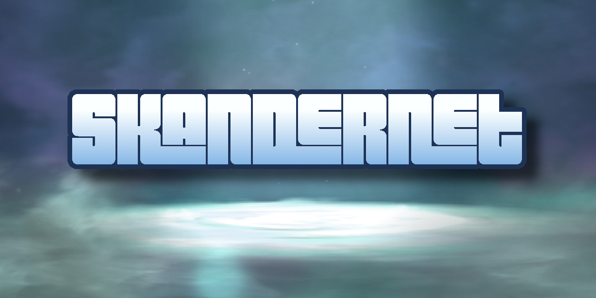

# SkanderNET

A NET Framework 4.6, C# 6.0 compatible library for connecting to Skylanders portals.
## Usage
Before communicating with the portal and figures, the portal must first be discovered.
This can be achieved with a simple loop. 
The PortalFinder requires a cancellation token. Declare a new token source and provide the token.
```cs
PortalFinder.OnPortalFound += OnPortalFound;
Task.Run(async () => { await PortalFinder.FindPortals(cts.Token); }, cts.Token);
```
Alternatively this can be designated to a background worker or coroutine (Unity).

When a portal is found, the `OnPortalFound` event is invoked providing a portal object.
This should be stored for communications.

As long as the `PortalFinder` task is running, any disconnected and reconnected portals will be re-detected.
Only one portal may be active at a time due to USB context constraints.

The Portal object provides the following events for subscription:
```cs
// Invoked when a Skylander is initially placed and its first sector containing character info is processed.
public event Action<int, Skylander> OnSkylanderPlaced;

// Invoked once the active data area is fully parsed and data can be read/written.
public event Action<int, Skylander> OnSkylanderProcessed;

// Invoked when a Skylander is removed from the portal.
public event Action<int, Skylander> OnSkylanderRemoved;

// Invoked when Save is called on a Skylander.
public event Action<int, Skylander> OnSkylanderSaved;

// Invoked when the portal is activated and ready to being receiving queries.
public event Action OnReady;

// Invoked when the portal throws an exception.
public event Action<Exception> OnError;
```
After subscribing to the events, you can call
```cs
portal.Activate();
```
To initialize the portal and allow it to start sending messages back and forth.

When a Skylander is placed on the portal and once the first few blocks of data are received, portal will invoke 
`OnSkylanderPlaced` with a Skylander object and its virtual slot index.

The Skylander, at this point, only has some of its data initialized and attempting to access other data will result
in a `SkylanderNotLoadedException`. 

The skylander's metadata may be accessed upon being placed. For example:
```cs
portal.OnSkylanderPlaced += (slot, skylander) =>
{
    SkylanderGenericData genericData;
    if (!skylander.TryGetMetaData(out genericData))
        return;
    Console.WriteLine($"{skylander.Name} was placed.");
};
```
Once the Skylander is processed, the `OnSkylanderProcessed` event is invoked and all public properties may be accessed.
```cs
portal.OnSkylanderProcessed += (slot, skylander) =>
{
    Console.WriteLine($"{skylander.Name} Processed.");
    Console.WriteLine($"{skylander.Name} has {skylander.Money} money.");
    Console.WriteLine($"{skylander.Name} is wearing {HatIndex.Hats[skylander.HatId]}.");
};
```

None of the data you modify is saved to the Skylander until 
```cs
skylander.Save()
```
is explicitly called.

This API leverages the NFC redundancy block to avoid corruption the same way the game does.

Using this API, you agree that any figure corruption or damage is the sole responsibility of the end user, and it is recommended that,
should you use the write capabilities of this API, you pass this message on to the end user.
Figures can almost always be restored by navigating to the settings menu on Giants or later from the main menu and selecting `Reset Broken Toys`.

Usage of this tool for the purposes of piracy or violating the protections placed on the figures is not permitted.

## Example
```cs
using System;
using System.Drawing;
using System.Threading;
using System.Threading.Tasks;
using SkanderNET;

namespace SkanderNET_Example
{
    internal class Program
    {
        static CancellationTokenSource cts = new CancellationTokenSource();
        static Portal _currentPortal;
        
        static void OnPortalFound(Portal portal)
        {
            _currentPortal = portal;
            
            portal.OnError += e => { 
                Console.WriteLine($"[ERROR] {e.Message}");
                portal.SetColor(Color.Red);
            };
            
            portal.OnReady += () =>
            {
                Task.Run(() =>
                {
                    for (int flashIndex = 0; flashIndex < 2; flashIndex++)
                    {
                        portal.SetColor(255, 255, 255);
                        Thread.Sleep(200);
                        portal.SetColor(0, 0, 0);
                        Thread.Sleep(200);
                    }
                    portal.SetColor(0, 255, 0);
                });
            };
            
            portal.OnSkylanderPlaced += (slot, skylander) =>
            {
                SkylanderGenericData genericData;
                if (!skylander.TryGetMetaData(out genericData))
                    return;
                Console.WriteLine($"{skylander.Name} was placed.");
                SetColorFromElement(portal, genericData.Element);
            };
            
            portal.OnSkylanderProcessed += (slot, skylander) =>
            {
                Console.WriteLine($"{skylander.Name} Processed.");
                Console.WriteLine($"{skylander.Name} has {skylander.Money} money.");
            };

            portal.OnSkylanderRemoved += (slot, skylander) => {

                Console.WriteLine($"{skylander.Name} was removed.");
                portal.SetColor(255, 255, 255);
            };
            
            portal.Activate();
        }
        
        public static void Main(string[] args)
        {
            PortalFinder.OnPortalFound += OnPortalFound;
            Task.Run(async () => { await PortalFinder.FindPortals(cts.Token); }, cts.Token);
        }

        static void SetColorFromElement(Portal portal, SkylanderElement element)
        {
            switch (element)
            {
                case SkylanderElement.None:
                    portal.SetColor(Color.FromArgb(255, 255, 255));
                    break;
                case SkylanderElement.Air:
                    portal.SetColor(Color.FromArgb(0x6c, 0xbc, 0xf5));
                    break;
                case SkylanderElement.Earth:
                    portal.SetColor(Color.FromArgb(0xdf, 0x90, 0x30));
                    break;
                case SkylanderElement.Fire:
                    portal.SetColor(Color.FromArgb(0xff, 0x00, 0x00));
                    break;
                case SkylanderElement.Water: 
                    portal.SetColor(Color.FromArgb(0x00, 0x00, 0xff));
                    break;
                case SkylanderElement.Magic:
                    portal.SetColor(Color.FromArgb(0xb7, 0x59, 0xf3)); 
                    break;
                case SkylanderElement.Tech:
                    portal.SetColor(Color.FromArgb(0xff, 0x70, 0x30));
                    break;
                case SkylanderElement.Life:
                    portal.SetColor(Color.FromArgb(0x00, 0xff, 0x00));
                    break;
                case SkylanderElement.Undead:
                    portal.SetColor(Color.FromArgb(0xd0, 0x90, 0xd0));
                    break;
                case SkylanderElement.Light:
                    portal.SetColor(Color.FromArgb(0xff, 0xcf, 0x80));
                    break;
                case SkylanderElement.Dark:
                    portal.SetColor(Color.FromArgb(0x23, 0x3e, 0x5b));
                    break;
                case SkylanderElement.Kaos:
                    portal.SetColor(Color.FromArgb(0x72, 0x66, 0x9b));
                    break;
                default:
                    throw new ArgumentOutOfRangeException(nameof(element), element, null);
            }
        }
    }
}
```

## Licensing

The full license for this project can be found in the License file provided but please note the following:
This project is licensed under Polyform Non-Commercial 1.0.0. 
Any modification of this library is permitted but must be redistributed under Polyform Non-Commercial 1.0.0.

This library also interfaces with LibUsbDotNet and therefore libusb, both of which are licensed under LGPL3.
As a result, any distribution of this library must maintain all components as separate libraries.
LibUsbDotNet therefore remains licensed under LGPL and SkanderNET under Polyform.
Statically linking both libraries into a single library or binary is prohibited as it forms a license conflict.

Any work distributed with this library may not be used for any commercial gains as expressed in the full Polyform license.
